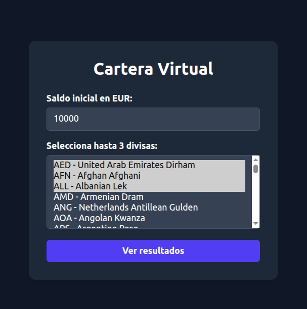
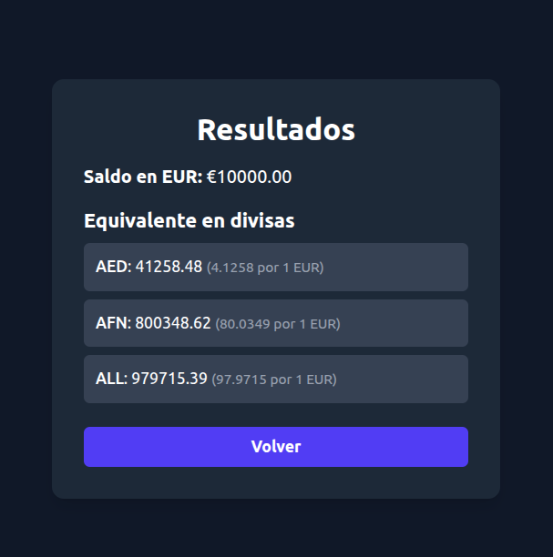

# 💱 Cartera Virtual de Divisas

Una aplicación React minimalista que permite gestionar un saldo en EUR y visualizar su equivalente en otras divisas utilizando la API pública de Coinbase.

## 🚀 Características

- ✅ Ingreso de saldo inicial en euros.
- ✅ Selección dinámica de hasta 3 divisas desde la API de Coinbase.
- ✅ Consulta de tasas de cambio en tiempo real.
- ✅ Interfaz moderna y responsive con TailwindCSS.
- ✅ Validaciones de uso y manejo de errores.
- ✅ Tests con Vitest y Testing Library.

## 📸 Capturas




## 🧪 Tecnologías usadas

- React 19
- Vite
- React Router DOM
- TailwindCSS
- Vitest + React Testing Library
- TypeScript

## 🔧 Instalación

1. Cloná este repositorio:

```bash
git clone https://github.com/pmirand6/react-wallet.git
cd react-wallet
````

2. Asegurate de tener Node.js >=18 y npm >=9. También podés usar nvm y ejecutar:
```bash
nvm use
```
3. Instalá las dependencias
```bash 
npm install
```

4. Iniciá la aplicación
```bash
npm run dev
```

🧪 Tests
Ejecutá los tests unitarios con:

```bash
npx vitest run
```


📁 Estructura del proyecto
```bash
src/
├── context/            # Contexto global con useReducer
├── pages/              # Vistas Home y Results
├── services/           # Servicios para llamar a la API de Coinbase
├── styles/             # Archivos de estilo (Tailwind)
└── tests/              # Pruebas con Testing Library
```


📌 Requisitos

- Saldo en EUR mayor a 0.
- Selección de hasta 3 divisas.
- Mostrar mensaje si falla la carga de divisas.